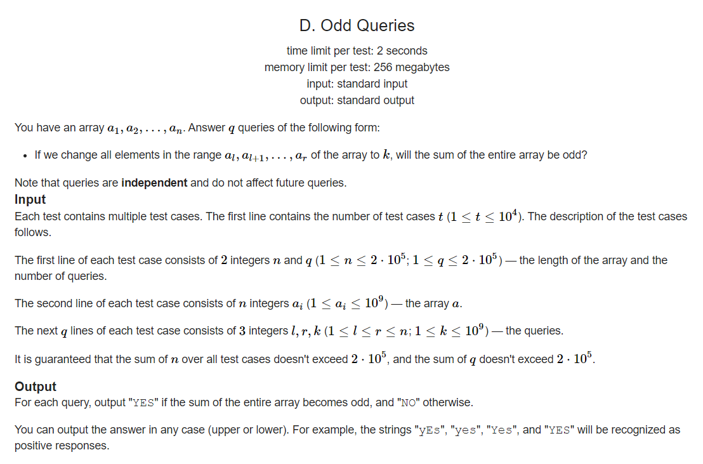
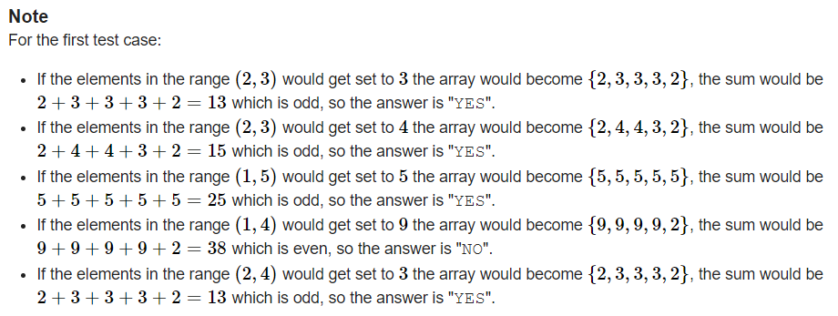

<h1 align="center">
Codeforces Round 859 (Div. 4)
</h1>




### Input :
```yaml
2
5 5
2 2 1 3 2
2 3 3
2 3 4
1 5 5
1 4 9
2 4 3
10 5
1 1 1 1 1 1 1 1 1 1
3 8 13
2 5 10
3 8 10
1 10 2
1 9 100
```

### Output :
```yaml
YES
YES
YES
NO
YES
NO
NO
NO
NO
YES
```




<h1 align="center">
[Solution](solution/README.md)
</h1>
