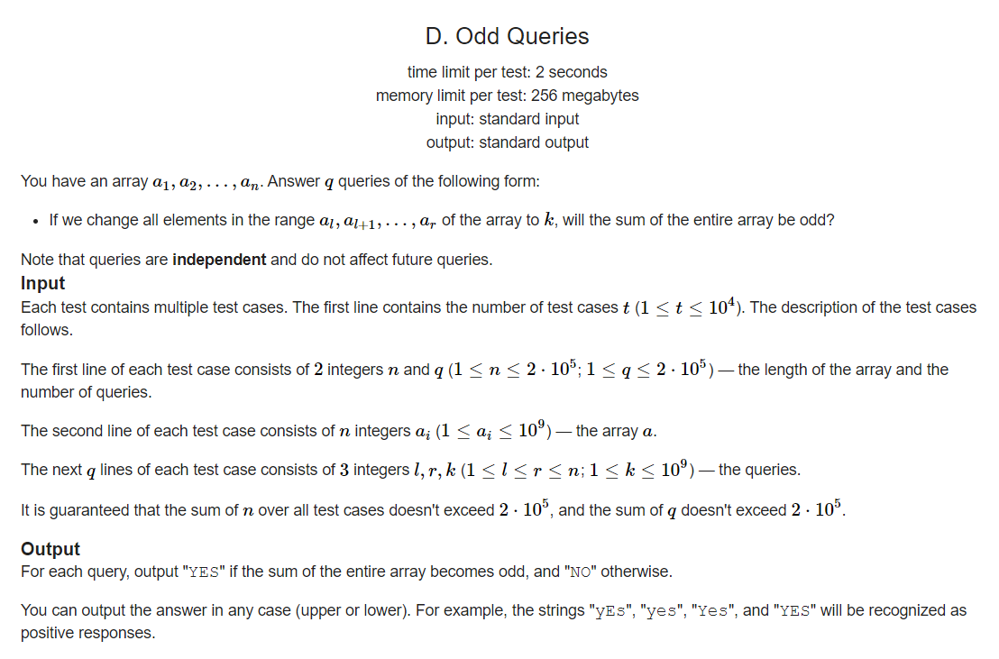

## Codeforces Round 859 (Div. 4)

D. Odd Queries
time limit per test2 seconds
memory limit per test256 megabytes
inputstandard input
outputstandard output
You have an array a1,a2,…,an
. Answer q
 queries of the following form:

If we change all elements in the range al,al+1,…,ar
 of the array to k
, will the sum of the entire array be odd?
Note that queries are independent and do not affect future queries.
Input
Each test contains multiple test cases. The first line contains the number of test cases t
 (1≤t≤104
). The description of the test cases follows.

The first line of each test case consists of 2
 integers n
 and q
 (1≤n≤2⋅105
; 1≤q≤2⋅105
) — the length of the array and the number of queries.

The second line of each test case consists of n
 integers ai
 (1≤ai≤109
) — the array a
.

The next q
 lines of each test case consists of 3
 integers l,r,k
 (1≤l≤r≤n
; 1≤k≤109
) — the queries.

It is guaranteed that the sum of n
 over all test cases doesn't exceed 2⋅105
, and the sum of q
 doesn't exceed 2⋅105
.

Output
For each query, output "YES" if the sum of the entire array becomes odd, and "NO" otherwise.

You can output the answer in any case (upper or lower). For example, the strings "yEs", "yes", "Yes", and "YES" will be recognized as positive responses.




### Input :
```yaml
2
5 5
2 2 1 3 2
2 3 3
2 3 4
1 5 5
1 4 9
2 4 3
10 5
1 1 1 1 1 1 1 1 1 1
3 8 13
2 5 10
3 8 10
1 10 2
1 9 100

```


